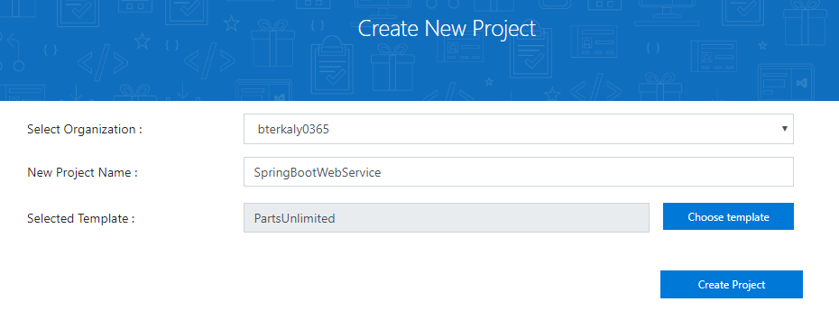
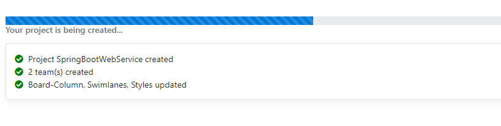
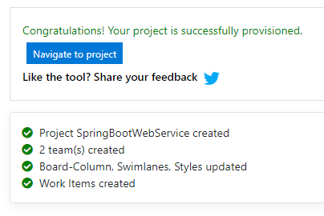
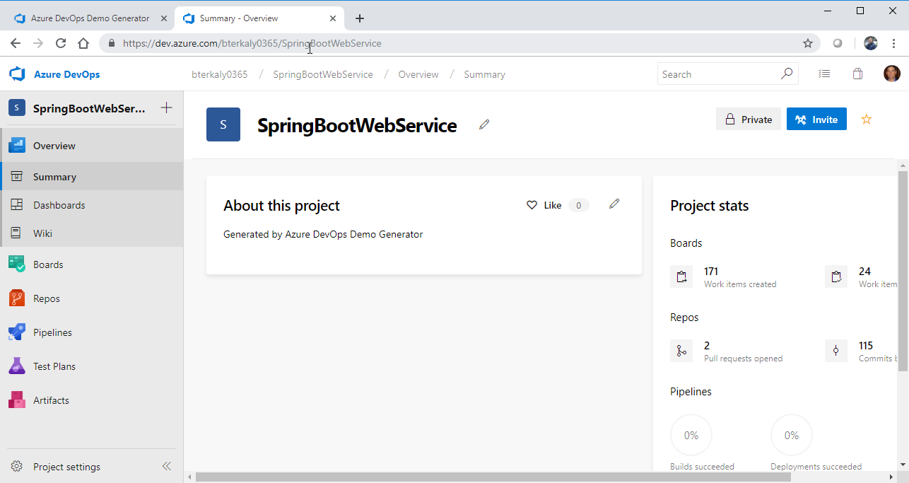

# Course 

What we really want to learn is how to do Continuous Integration using Azure DevOps. There are all kinds of tools and technologies that can be used to build a DevOps Pipeline. Jenkins is a popular tool.

In these next few modules we will take advantage of Azure DevOps to implement our pipeline.


There is a full-blown course here at SkillMeUp that can walk you through the lessons learned.

https://opsedx.skillmeup.com/courses/course-v1:Microsoft+AZ-400.2+2019_T1/courseware/083e1ae3-93c7-1f72-6306-1765a78799e4/649fcbb5-9ffd-8340-28fb-ffd7acdf7aa2/4?activate_block_id=block-v1%3AMicrosoft%2BAZ-400.2%2B2019_T1%2Btype%40vertical%2Bblock%402eb4ba56-0427-ce08-0160-8b15e1bbd475

## Azure DevOps Demo Generator

```
https://azuredevopsdemogenerator.azurewebsites.net/
```

## Parts Unlimited



_Figure: 1, dev-ops-lab-partsunlimited_



_Figure: 2, project-being-created_



_Figure: 3, project-created_



_Figure: 4, azure-devops_

# You should be merging all the time

You need to avoid long-lived branches. Need to constantly integrate, avoid isolation. You need to share code and frequently merge code. You want to compile all the time.

Merge conflicts, hard to fix bugs, duplicated effort, tons of compile time errors.

- Missing dependencies
- Bad reference
- Missing classes

Shared version control repository. The goal is to notice commits and to get latest chances and compile. Code is built and tested.

Trunks and branches are the main development areas. The trunk is the central superstructure and branches are created for adding new features or enhancemenets. Branches are also used for bug fixes and maintenance. Branches get merged back into trunks when changes or new features are complete. Branches allow parallel development efforts.

A head is the latest version in the repository. That is either in the trunk or branch.

The process is more than just unit tests. You could be validating code quality, security vulnerabilities, and more.

When a feature or branches complete, the developer issues a pull request.

A pull request is nothing more than just a request that someone else review the work that you've done so that they can merge your changes in to the main trunk. When creating a pull request you select two branches. The first branch is the branch that you have made your changes on. And the second branch is where you would want to merge your changes into.


The administrators of the main trunk will review your changes. They may even leave a comment on the pull request, asking you to make additional changes before it can be merged in. If you are required to make changes for your pull request, you would simply make another change to your branch, commit that change, and push your branch again as a pull request. 


Oftentimes administrators of a repository will maintain a high quality bar and even bake that into the continuously integrating pipeline (known as Branch Policies). Naturally, you want to find bugs as early in the development process as possible.
 
 Azure DevOps/Pipeline has been built to support a continuous integration pipeline. It's built in a flexible way that supports a variety of existing pipelines.

 ## The 4 Areas of Continuous Integration

 ### (1) Version Control

Manging source code. 


 ### (2) Package Management

Products like Nuget, Maven 


 ### (3) Continuous Integration

Azure DevOps or Jenkins.


 ### (4) Automated Build Process

Gradle, Apache ANT

