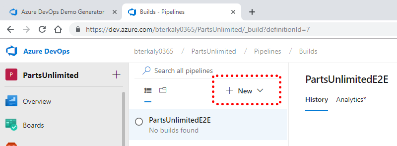
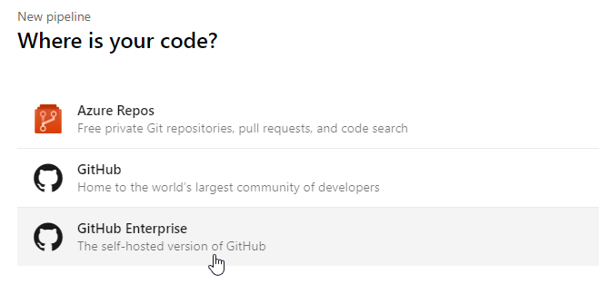
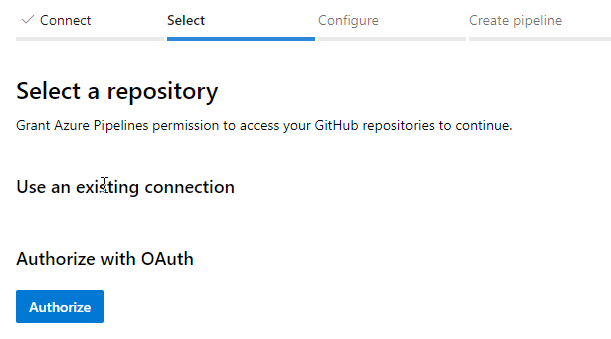
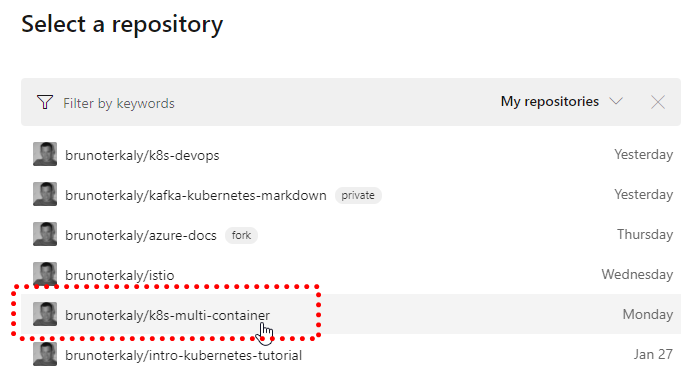
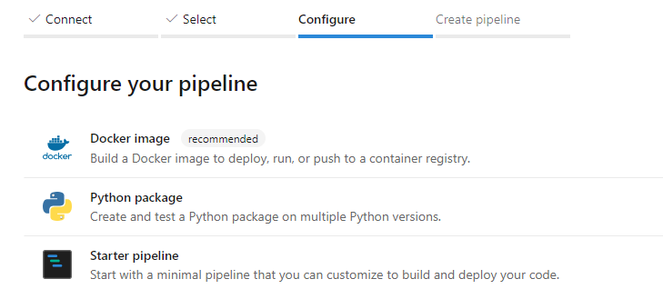
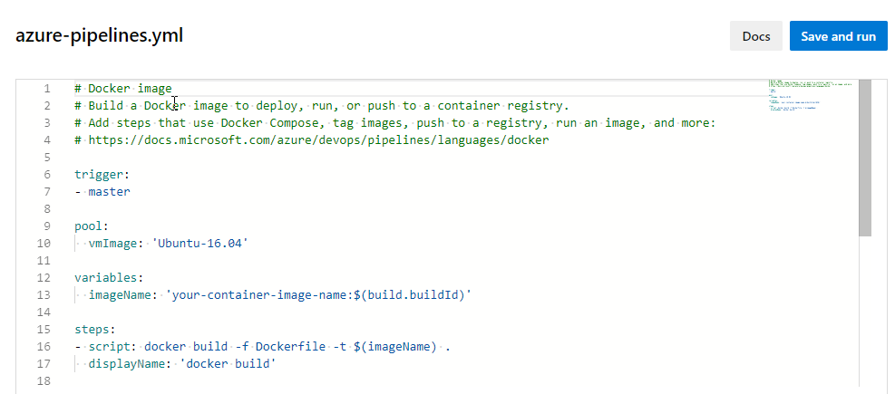
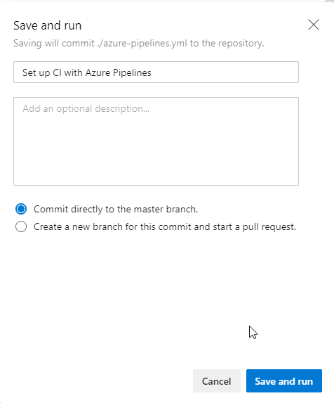

### Choose New Build Pipeline:

At this point create a new pipeline.



_Figure: 5, new-pipeline_

### Use an Existing Github Repo:

I am going to choose my own Github repo.



_Figure: 6, choose-github-repo_

### Login:

It is required to login using your Github account.



_Figure: 7, github-authorize_

### Selecting my own Repo:

I will choose brunoterkaly/k8s-multi-container.



_Figure: 8, select-repo_

### Choosing "Docker Image":

 Since all of my workloads are containerized, it makes sense to choose "Docker Image."



_Figure: 9, config-pipeline_

### Viewing the Default Template that is generated:

A template will be generated that requires us to edit and configure for our own scenario.



_Figure: 10, azure-pipelines_

### Saving and Running:

You will be asked to save and run it.



_Figure: 11, save-and-run_

# Identity for docker

In YAML, you must explicitly map System.AccessToken into the pipeline using a variable. You can do this at the step or task level:

```
steps:
  - bash: echo This is a script that could use $SYSTEM_ACCESSTOKEN
    env:
      SYSTEM_ACCESSTOKEN: $(System.AccessToken)
  - powershell: Write-Host "This is a script that could use $env:SYSTEM_ACCESSTOKEN"
    env:
      SYSTEM_ACCESSTOKEN: $(System.AccessToken)

- script: docker login -u $(dockerId) -p $(pswd) <docker-registry-url>

pool:
  vmImage: 'ubuntu-16.04'


variables:
  imageName: 'py-red:$(build.buildId)'
  dockerId: brunoterkaly
  pswd: BrunoAria_2015

steps:
- script: |
    docker login -u $(dockerId) -p $(pswd)
  - script: docker build -t $(dockerId)/$(imageName) . 
    docker push $(dockerId)/$(imageName)


- script: |
    docker build -t $(dockerId).azurecr.io/$(imageName) .
    docker login -u $(dockerId) -p $(pswd) $(dockerId).azurecr.io
    docker push $(dockerId).azurecr.io/$(imageName)    

- script: |
    docker-compose -f docs/docker-compose.yml --project-directory . -p docs up -d
    docker wait docs_sut_1
    docker-compose -f docs/docker-compose.yml --project-directory . down
```

## Peronal Access AccessToken

Azure DevOps

h67i6vkifd6ntfbwqnghvlvxhxsrpka2qt4jgxkwxw2cwuwddoma